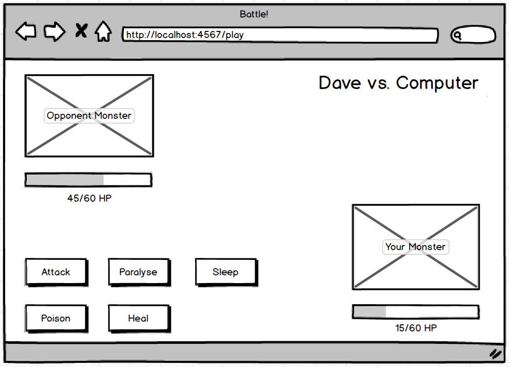

# Battle challenge

[](https://travis-ci.org/joemccann/dillinger)

With our new HTTP understanding, response-request mechanisms, Sinatra, and Capybara we are going to construct a project that uses these technologies.

The project is called 'Battle'. Here is a mockup of how it might look towards the end:



### Tech

Battle challenge uses a number of open source projects to work properly:

* [Ruby/ERB] - For logic and HTML enhanced for web apps!
* [Capybara] -  test automation software that simulates scenarios and automates web application testing for BDD
* [Sinatra] - Sinatra is a DSL for quickly creating web applications in Ruby with minimal effort
* [RSpec] - For unit testing purposes.

### Installation

Install the dependencies and devDependencies and start the server.

```sh
$ cd battle
$ bundle install
$ shotgun
```

